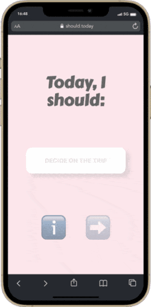

# should: a minimalist to-do app (PWA)

We believe in the power of just three daily tasks: the most important, a nice-to-do, and the least important. As the day ends, these tasks reset, ensuring a fresh start for each new day. Join us in simplifying productivity – with each task limited to 25 characters – and experience the magic of minimalist daily planning. **should:** works offline on every platform. You can actively engage with your tasks, and they are reset at midnight every day.

## Features

- **Progressive Web App**: This application is a Progressive Web App, which means you can access it through your web browser on any platform, and it offers a responsive and app-like experience.

- **Offline Support**: You can use this app even when you're offline. Your tasks and progress will be saved locally on your device and synchronized when you're back online.

- **Local Storage**: The app utilizes local storage to save your tasks, so you don't have to worry about losing your progress.

- **Task Management**: You can set tasks for the day across different categories. The app allows you to specify tasks you should complete, tasks that would be nice to complete, and tasks you might consider doing.

- **Automatic Reset**: At midnight every day, the app automatically resets your tasks, providing you with a fresh start for the new day.

## Getting Started

To use the Task Manager app, follow these steps:

1. **Access the App**: Open your web browser and navigate to the URL where the app is hosted.

2. **Task Entry**: On the main screen, you will see categories for your tasks. Enter the tasks you want to complete for the day in each category. If you're not sure, you can click the "Random Task" button to get a suggestion.

3. **Save Tasks**: Once you've entered your tasks, click the "Save" button to store them. Your tasks will be saved locally on your device.

4. **Manage Tasks**: Throughout the day, you can mark tasks as completed or edit them as needed.

5. **End of Day**: At midnight, your tasks will be reset, and you can start entering tasks for the new day.

## Technologies Used

The Task Manager app is built using React, a popular JavaScript library for building user interfaces. It also utilizes modern web technologies such as Progressive Web App capabilities and local storage for data persistence.

## Installation

No installation is required to use this app. Simply access it through your web browser using the provided URL or add to your home screen on your mobile device or computer.

## Development Setup

If you're interested in contributing to the development of this app, follow these steps:

1. **Clone the Repository**: Clone this repository to your local machine using Git.

2. **Install Dependencies**: Navigate to the project directory and run the command `npm install` to install the necessary dependencies.

3. **Start the Development Server**: Run the command `npm start` to start the development server. This will launch the app in your default web browser.

4. **Make Changes**: You can make changes to the code in the `src` directory. The app's entry point is the `App.js` file.

5. **Build**: If you want to build the app for production, use the command `npm run build`. This will create optimized production-ready files in the `build` directory.

## Contributing

Contributions to the Task Manager app are welcome! If you find any issues or have suggestions for improvements, please create a pull request or submit an issue in the GitHub repository.

## License

This project is licensed under the MIT License - see the [LICENSE](LICENSE) file for details.